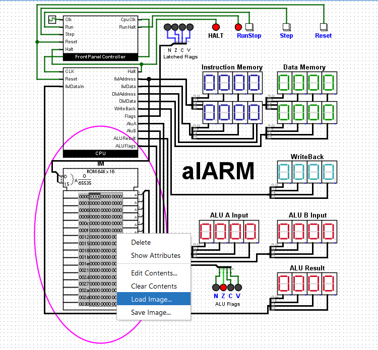
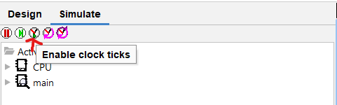
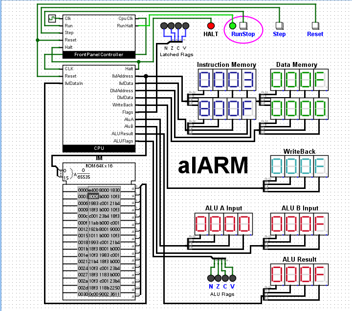

# CPU-in-Logisim
---

This project is made in Logisim Evolution 3.7.2 to build a CPU using IFU, Register Files, Data memory, ALU, and Decoder

## How to run the file

1. Download Logisim-Evolution 3.7.2 using this [link](https://github.com/logisim-evolution/logisim-evolution/releases/download/v3.7.2/logisim-evolution-3.7.2.msi)
2. Then just follow the instructions on the installer
3. Once it's installed, run the application and open the CPU 
    * It should look like this 
    - 
4. Now on the right bar, double click on the "main" 
    * It should open this new page
    - 
5. Now load up the Instructions using the Instruction in Hex.txt
    * On the ROM IM console, right-click and press load image then select the "[Instructions in Hex.txt](<Instructions in Hex.txt>)" in this folder
    - 
6. Once its loaded press the Simulate button on the bar then press "Enable clock ticks" 
    * It should be the third small button
    - 
7. Now to run and execute the instructions 
    * press the Run/Stop button, you can also run it one by one by pressing the Step button, and reset it by pressing the Reset button
    - 
8. The result is listed on the ALU Result 

## Purpose

1. This CPU in Logisim runs instructions such as Add, Substract, Divide, Multiplication, AND, OR, XOR, NOT, bit shift, and Arithmetic bit shift
2. It then outputs the result and run until it reaches Halt. 

### Link to newer version of Logisim
1. If you want to play around with Logisim Evolution then here are different versions from the official Logisim github page
    - [Click here](https://github.com/logisim-evolution/logisim-evolution/releases)